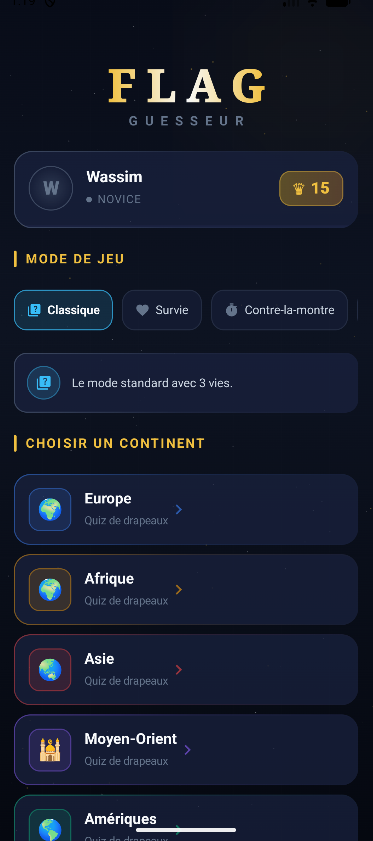
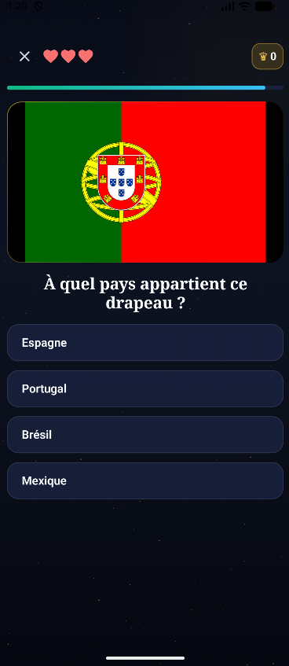
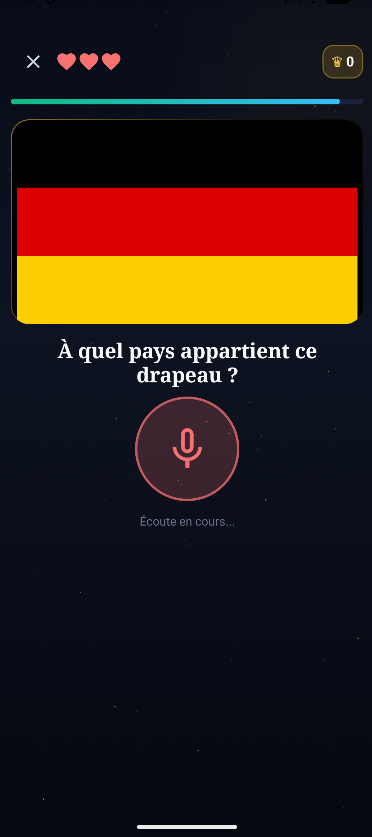
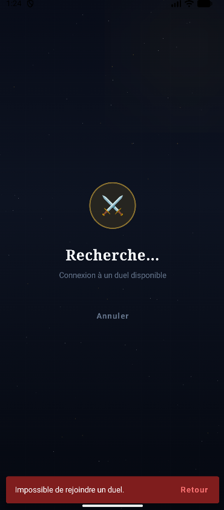
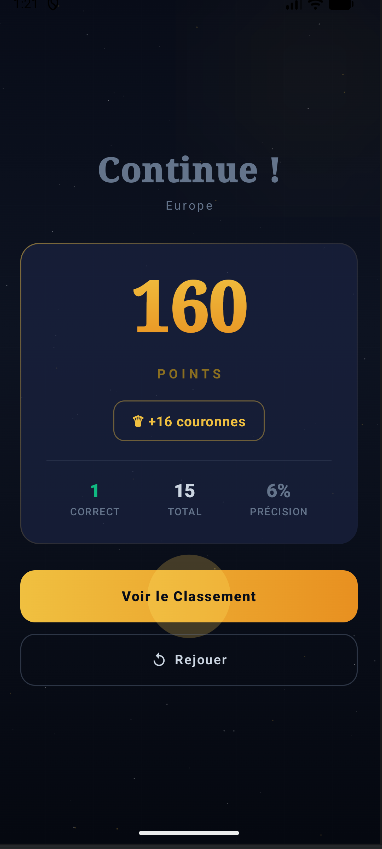

# 🌍 FlagGuesseur

**Application Android de Quiz Géographique Interactive**

> Une expérience ludique de reconnaissance de drapeaux avec 7 modes de jeu, gamification complète et synchronisation temps réel.

---

## 📋 Vue d'ensemble

**FlagGuesseur** est une application mobile native développée en **Kotlin** avec **Jetpack Compose**, proposant un quiz interactif de reconnaissance de drapeaux nationaux couvrant **70+ pays** répartis en **7 catégories géographiques**.

Parfait pour :
- 🎓 Apprendre la géographie de façon ludique
- 👥 Affronter des adversaires en duel temps réel
- 🏆 Grimper les classements mondiaux
- 🎮 Profiter de 7 modes de jeu distincts

---

## 📹 Vidéo de Démonstration

Découvrez l'application en action : modes de jeu, duel temps réel, système de couronnes et bien plus ! 🎮

---

## ✨ Fonctionnalités Principales

### 🎮 7 Modes de Jeu
- **Classique** : Mode standard (3 vies, 15s/question)
- **Survie** : Timer accéléré (1 vie, points doublés)
- **Contre-la-montre** : 60s partagées
- **Capitales** : Identifie la capitale du pays
- **Zen** : Apprentissage sans stress
- **Vocal** : Prononce le nom du pays 🎤
- **Duel** : 1v1 temps réel 🔴

### 💰 Système de Gamification
- **Couronnes** : Monnaie in-app (Indice 50♛, Revive 200-1000♛)
- **6 Niveaux** : Novice → Maître des Nations
- **Classement mondial** : Top 100 temps réel Supabase
- **Notifications** : Alertes au nouveau record

### 📡 Technologie Cloud
- **Supabase** : Leaderboard + Mode duel (polling 2s)
- **Room** : Cache local SQLite (mode hors-ligne)
- **Remote-First + Fallback** : Données toujours disponibles

### 🎨 Interface Moderne
- Thème **Atlas Nocturne** (sombre, élégant, premium)
- Glassmorphism avec animations fluides
- 60 FPS constant avec Compose

---

## 🛠️ Stack Technologique

| Catégorie | Tech |
|-----------|------|
| Langage | Kotlin 2.x |
| UI | Jetpack Compose + Material Design 3 |
| Architecture | MVVM + Repository Pattern |
| Base Locale | Room 2.x (SQLite) |
| Base Cloud | Supabase (PostgreSQL) |
| Réseau | Retrofit 2 + OkHttp 4 |
| Images | Coil 2 (SVG support) |
| Voix | Android SpeechRecognizer |
| Animations | Lottie + Compose Animations |
| Minimum SDK | API 24 (Android 7.0) |
| Target SDK | API 35 (Android 15) |

---

## 📦 Installation

### Prérequis
- Android Studio 2023.1+
- JDK 17+
- Gradle 8.x

### Configuration

1. **Clone le dépôt**
\\\ash
git clone https://github.com/Wvssim/FlagGuesseur.git
cd FlagGuesseur
\\\

2. **Configure les clés API** (\local.properties\)
\\\properties
SUPABASE_URL=https://[project-id].supabase.co
SUPABASE_ANON_KEY=eyJhbGci...
OPENROUTER_API_KEY=sk-or-...
\\\

3. **Build et run**
\\\ash
./gradlew installDebug
\\\

---

## 🚀 Utilisation

### Démarrage
1. Sélectionne un **mode de jeu**
2. Choisis un **continent**
3. Réponds aux questions
4. Gagne des **couronnes** 🏆
5. Consulte le **classement mondial**

### Modes Spéciaux
- **Vocal** : Prononce le pays (SpeechRecognizer)
- **Duel** : Affronte un adversaire en temps réel
- **Indice** : Déverrouille avec 50 couronnes

---

## 📸 Captures d'écran

**Écran d'accueil — Sélection mode et catégorie**

**Mode Classique — Quiz avec drapeau et options**

**Mode Vocal — Reconnaissance de parole 🎤**

**Mode Duel — Affrontement 1v1 en temps réel**

**Écran Résultats — Score et couronnes gagnées**

---

## 🏗️ Architecture

### Pattern MVVM + Repository
\\\
UI (Compose) → ViewModel → Repository → Data (Room/Supabase/Seed)
\\\

### Stratégie Remote-First
1. Tentative Supabase → Questions fraîches
2. Succès → Cache Room + Retour
3. Erreur réseau → Cache Room
4. Cache vide → SeedData embarquées

---

## 📊 Statistiques

- **Lignes de code** : ~8,000+ Kotlin
- **Composants Compose** : 40+
- **Modes de jeu** : 7
- **Pays couverts** : 70+
- **Catégories** : 7

---

## 📝 Rapport Technique

Rapport complet en PDF avec architecture MVVM, diagrammes UML, spécifications techniques et démonstration.

📥 **[Télécharger le rapport PDF](./Flaguesser_Wassim_Lazim.pdf)** (Architecture, cas d'usage, implémentation, perspectives)

---

## 🤝 Contribution

Les contributions sont bienvenues !
1. Fork le projet
2. Crée une branche : \git checkout -b feature/ma-feature\
3. Commit : \git commit -am 'Ajoute ma feature'\
4. Push et ouvre une Pull Request

---

## 📧 Contact

**Auteur** : Wassim Lazim  
**Email** : Wasssimlazim7@gmail.com

---

**⭐ N'hésite pas à mettre une star !**

